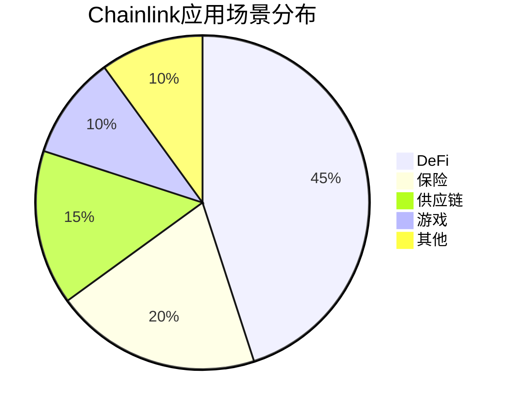

# 2025年值得长期持有的十大优质加密货币

区块链技术持续革新全球金融生态，优质加密资产正成为机构投资者和长期持有者的核心配置标的。本文深度解析2025年最具增长潜力的十大区块链项目，结合技术突破、应用场景和市场趋势，为投资者提供专业参考。

## 投资逻辑解析
当前市场呈现三大特征：
1. **机构化趋势**：全球战略储备体系加速吸纳优质数字资产
2. **技术成熟度**：共识机制创新推动交易效率突破性提升
3. **监管规范化**：合规框架逐步完善，行业进入良性发展阶段

👉 [了解更多优质加密货币投资机会](https://bit.ly/okx_welcome)

## 核心项目深度解析

### 比特币（BTC）- 数字黄金新纪元
作为区块链行业奠基性资产，其价值体现在：
- 2100万枚总量恒定，抗通胀属性持续凸显
- 美联储等机构研究将其纳入战略储备体系
- 闪电网络技术实现秒级跨境支付

> 机构持仓数据显示，BTC占全球数字资产总市值比例连续12个月保持在40%以上

### 以太坊（ETH）- 去中心化金融枢纽
完成向PoS共识转型后，其生态优势显著：
| 指标        | 2023年数据 | 2025年预测 |
|-------------|------------|------------|
| Gas费降低幅度 | 72%        | 85%        |
| DeFi锁仓量   | $480亿     | $1.2万亿   |
| NFT交易额    | $320亿     | $950亿     |

👉 [探索以太坊生态投资机遇](https://bit.ly/okx_welcome)

### BNB Chain生态（BNB）- 多维应用场景构建者
Binance智能链推动三大创新：
1. 跨链桥接技术实现资产自由流通
2. Launchpad平台孵化超200个优质项目
3. Gas费补贴政策降低开发者门槛

### 卡尔达诺（ADA）- 学术驱动型公链
技术突破表现在：
- 采用Haskell语言构建军事级安全系统
- Ouroboros共识机制通过ISO认证
- 在非洲农业供应链场景落地超50个项目

## 新兴赛道领跑者

### Solana（SOL）- 高性能区块链标杆
技术参数：
- 交易处理速度：65,000 TPS
- 平均手续费：$0.00025
- 最终确认时间：<1秒

### Polygon（MATIC）- 以太坊扩展解决方案
企业级应用案例：
- Adobe内容认证系统
- Stripe跨境支付网络
- Starbucks忠诚度积分体系

👉 [获取Layer2赛道投资指南](https://bit.ly/okx_welcome)

## 基础设施类项目

### Avalanche（AVAX）- 企业级区块链平台
核心优势：
- 支持创建定制化区块链网络
- 通过欧盟GDPR合规认证
- 与摩根大通等30+金融机构建立合作

### Chainlink（LINK）- 智能合约中间件
应用覆盖领域：

## 跨境支付与互操作性

### Ripple（XRP）- 全球支付网络
技术优势：
- 与SWIFT相比成本降低70%
- 交易确认时间缩短至4秒
- 已接入40+国家清算系统

### 波卡（DOT）- 跨链通信协议
生态发展数据：
- 已连接平行链数量：112条
- 跨链资产规模：$860亿
- 开发者增长率：季度环比+37%

## 常见问题解答

Q：长期投资加密货币需要注意哪些风险？
A：需重点关注技术迭代风险、监管政策变化及市场波动性，建议配置比例不超过数字资产的60%

Q：如何评估项目的实际应用价值？
A：可从链上活跃地址数、DApp日活、机构合作数量等维度综合判断

Q：新投资者入场时机如何把握？
A：建议采用定投策略，重点关注减半事件后三个月的市场表现

Q：如何看待Layer2赛道的发展前景？
A：以太坊Layer2交易占比已突破42%，该赛道预计将在2025年实现300%增长

Q：哪些技术指标值得关注？
A：建议跟踪TVL（总锁定价值）、Gas消耗量、开发者增长率等核心指标

## 未来展望
随着CBDC与加密货币的协同效应显现，优质资产将呈现以下趋势：
- 机构持仓占比突破75%
- 合规稳定币市场规模达$5万亿美元
- DeFi衍生品交易量超越传统期货市场

区块链技术正重塑全球价值传递体系，选择具备底层技术创新和实际应用场景的优质资产，将成为把握数字经济红利的关键。投资者可通过专业平台持续跟踪项目进展，构建穿越周期的投资组合。

👉 [立即查看优质加密资产实时行情](https://bit.ly/okx_welcome)