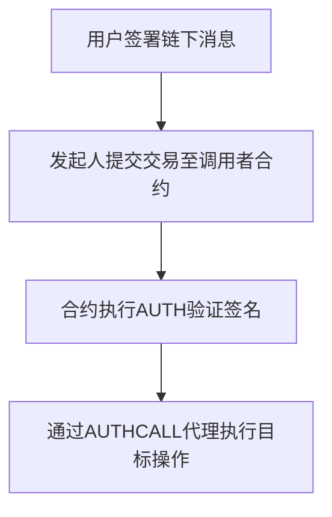
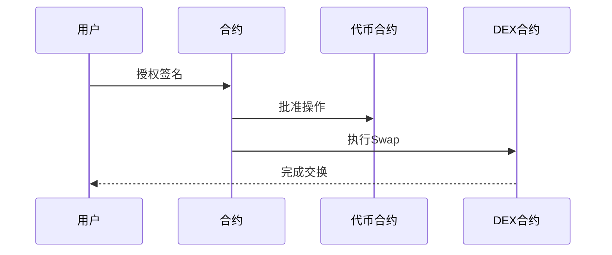

# EIP-3074被纳入以太坊布拉格升级 三分钟读懂EIP3074

在4月12日举行的以太坊第183次ACDE会议上，EIP-3074正式被纳入下一次以太坊硬分叉Pectra升级（即布拉格升级）。这项技术革新引发了区块链行业对账户抽象领域的深度探讨，其核心价值在于重构用户与智能合约的交互方式。

## 技术原理深度解析

### EIP-3074的核心机制
该提案通过引入两个创新性EVM操作码实现技术突破：
- **AUTH操作码 (0xf6)**：构建用户身份验证体系
- **AUTHCALL操作码 (0xf7)**：建立合约代理执行通道

这两个操作码形成技术闭环：用户通过ECDSA签名授权特定EOA（外部账户），智能合约在验证签名后可代理执行链上操作。这种架构突破了传统账户模型的限制，使外部账户获得智能合约级别的功能扩展。

### 技术实现流程

## 革命性应用场景

### 三大创新用例对比
| 应用场景      | 传统方式痛点                | EIP-3074解决方案               |
|---------------|---------------------------|------------------------------|
| 赞助交易      | 需预置Gas费限制用户参与     | DApp可承担Gas费用             |
| 批量操作      | 多步骤操作增加交互成本      | 单笔交易完成组合操作          |
| 资产恢复      | 私钥丢失导致资产永久冻结    | 社交恢复机制保障资产安全      |

### 典型案例演示
以去中心化交易所交易为例：

## 技术演进对比分析

### 与ERC-4337的差异化
| 维度          | EIP-3074                  | ERC-4337                  |
|---------------|---------------------------|---------------------------|
| 实现层级      | EVM指令集升级             | 合约层解决方案            |
| 兼容性        | 需硬分叉支持              | 无需网络升级              |
| 安全依赖      | 调用者合约可信度          | 用户操作自主性            |
| 扩展潜力      | 支持原生账户抽象          | 依赖基础设施改造          |

## 潜在风险与挑战

### 安全性关键考量
1. **调用者合约风险**：需通过形式化验证确保不可变性
2. **重入攻击隐患**：现有防护机制可能失效
3. **签名验证漏洞**：需防范量子计算威胁

### 实施难点解析
- 硬分叉升级带来的网络共识挑战
- 现有DApp生态的适配成本
- 用户教育门槛与接受度

## 行业影响预测

### 对Web3生态的变革
1. **游戏领域**：实现无感链上交互体验
2. **DeFi领域**：降低复杂操作门槛
3. **社交领域**：构建去中心化身份体系

👉 [立即体验区块链创新应用](https://bit.ly/okx_welcome)

## FAQ常见问题解答

**Q：EIP-3074如何保障用户资产安全？**  
A：通过智能合约白名单机制和签名验证体系，确保只有授权操作才能执行，但需警惕调用者合约的漏洞风险。

**Q：普通用户如何受益于这项升级？**  
A：将获得免Gas费交易、一键批量操作、资产恢复等便捷功能，显著降低区块链使用门槛。

**Q：该升级对现有钱包生态有何影响？**  
A：将催生新一代智能钱包，支持会话密钥、社交恢复等创新功能，推动钱包服务向更高级别进化。

👉 [探索下一代区块链钱包](https://bit.ly/okx_welcome)

## 技术演进路线图

| 阶段        | 时间节点   | 核心目标                  |
|-------------|------------|---------------------------|
| 基础实现    | 2024Q2     | 完成布拉格升级部署        |
| 生态适配    | 2024Q3     | 主流钱包/DApp兼容支持     |
| 应用爆发    | 2025Q1     | 创新型DApp集中涌现        |
| 标准制定    | 2025Q4     | 形成账户抽象技术标准体系  |

这项技术突破标志着以太坊向完全账户抽象化迈出关键一步。随着布拉格升级的推进，区块链交互体验将迎来革命性变革，为大规模应用落地扫清关键障碍。

👉 [把握区块链技术变革机遇](https://bit.ly/okx_welcome)