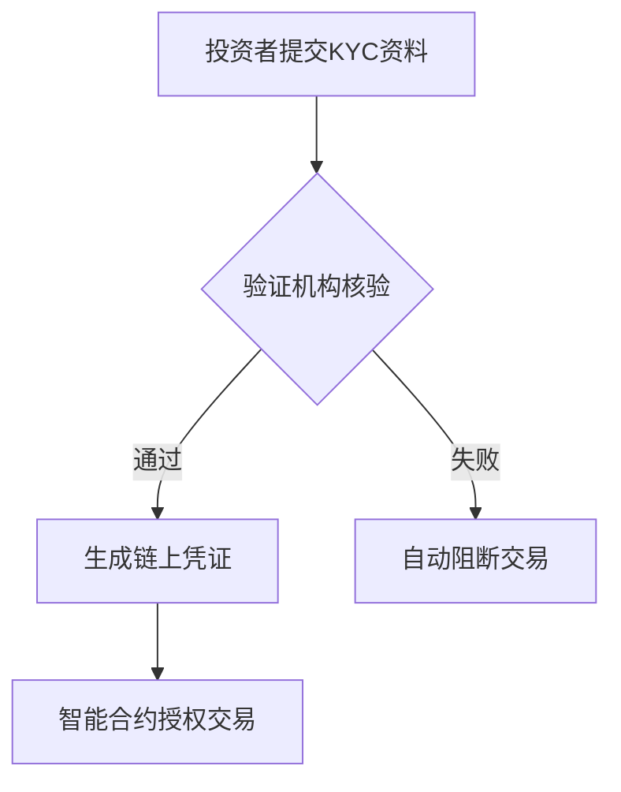

# ERC3643：现实世界资产（RWA）代币化的合规新标准

## RWA：区块链发展的下一阶段

区块链技术虽然发展不足十年，却已展现出颠覆传统金融的潜力。相较于加密货币（1.09万亿美元市值）和NFT的波动性，现实世界资产（RWA）的代币化更值得关注——全球房地产市场价值高达330万亿美元，资本市场规模更是远超想象。这种价值转移将通过区块链技术实现效率革命。

**核心数据对比**：
| 资产类别       | 市场规模         | 区块链渗透率 |
|----------------|------------------|--------------|
| 加密货币       | 1.09万亿美元     | 0.3%         |
| 全球房地产     | 330万亿美元      | 0.001%       |
| 资本市场总额   | 超千万亿美元     | 极低         |

👉 [探索区块链金融新机遇](https://bit.ly/okx_welcome)

## 私募市场的效率革命

传统私募交易存在三大痛点：
1. **流动性困境**：LP权益转让平均耗时6-18个月
2. **信息孤岛**：依赖人工文档传递导致尽调效率低下
3. **合规成本**：跨境交易需重复进行KYC/AML验证

ERC3643标准通过智能合约实现四大革新：
- **自动化KYC**：嵌入式可验证凭证即时验证投资者资质
- **智能清算**：代币化支付实现T+0结算无对手风险
- **合规转让**：自动执行投资者白名单限制
- **全生命周期管理**：支持代币冻结、分红等功能

## RWA代币化技术解析

### 代币标准对比矩阵

| 特性            | ERC20          | ERC721         | ERC3643                |
|-----------------|----------------|----------------|------------------------|
| 适用场景        | 同质化通证     | NFT收藏品      | 证券类资产             |
| 转让权限        | 自由转让       | 自由转让       | 受限转让               |
| 身份验证        | 无             | 无             | 强制验证               |
| 合规功能        | 无             | 无             | 白名单/黑名单控制      |
| 功能模块        | 12项           | 19项           | 120+项                 |

### 核心技术突破
1. **ONCHAINID系统**：将投资者身份信息加密锚定在链上，实现隐私保护下的合规验证
2. **动态规则引擎**：支持实时更新监管政策，如美国SEC Reg D与欧盟MiCA同步适配
3. **跨链互操作性**：兼容以太坊、Polkadot等主流公链，促进全球流动性

👉 [获取区块链技术白皮书](https://bit.ly/okx_welcome)

## 合规性技术实现

### 三步验证机制

### 实际交易场景模拟
假设A持有价值500万美元的私募股权代币（ERC3643标准），希望转让给机构投资者B：
1. A在去中心化交易平台挂单
2. B的数字身份钱包自动提交合规凭证
3. 智能合约验证B符合"合格投资者"标准
4. USDC稳定币与代币实现原子交换
5. 交易记录实时同步至监管沙盒节点

## 区块链合规未来图景

### 监管科技（RegTech）融合趋势
- **实时审计**：监管机构可设置观察节点，获取链上交易实时数据
- **智能沙盒**：支持监管政策的A/B测试与逐步推行
- **跨司法管辖**：通过零知识证明实现欧盟GDPR与美国SEC规则的兼容

### 行业应用前景
1. **房地产证券化**：伦敦商业物业代币化平台已实现0.5%年化管理成本（传统REITs为1.5%）
2. **供应链金融**：迪拜贸易平台使中小企业融资审批时间从45天缩短至4小时
3. **碳信用交易**：新加坡能源企业通过代币化降低跨境碳配额交易成本60%

👉 [参与区块链创新测试](https://bit.ly/okx_welcome)

## 常见问题解答

Q：ERC3643如何平衡隐私保护与合规要求？
A：采用零知识证明技术，验证机构仅能确认"通过/拒绝"状态，无法获取具体身份信息。

Q：传统金融如何接入代币化资产？
A：通过数字资产网关（如Bison Trails服务），可实现SWIFT与区块链协议的双向映射。

Q：个人投资者如何参与RWA代币交易？
A：需通过合规DeFi平台（如Maple Finance）完成KYC认证，最低投资门槛已降至1000美元。

Q：ERC3643与传统证券清算系统的差异？
A：结算速度从T+2提升至实时完成，跨境交易费用从0.5-1%降至0.05%以下。

Q：代币化资产的税收处理方式？
A：多数司法管辖区采用"实质经济活动"原则，需配合链上审计工具（如Chainalysis）进行申报。

## 价值重构的金融未来

随着新加坡MAS、英国FCA等监管机构推出代币化沙盒，2024年Q2全球RWA代币市场规模已突破1200亿美元。ERC3643标准正在重塑：
- **流动性池**：私募资产年化换手率从0.8次提升至5次
- **参与门槛**：合格投资者准入标准从百万美元降至10万美元
- **运营成本**：传统信托管理费从1.2%降至0.3%的智能合约维护费

这场始于标准协议的变革，正在构建价值互联网的基础设施。当330万亿美元的现实资产获得数字身份，金融民主化将真正成为可能。