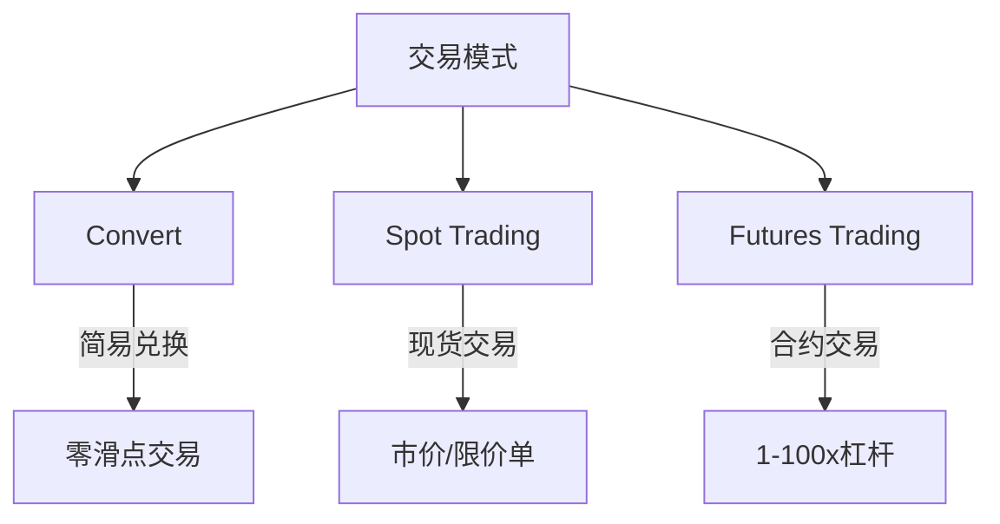

```markdown
# OKX使用指南：从开户到交易的全流程图文教程

## 一、为什么选择OKX？
作为全球交易量排名前二的加密货币交易所，OKX凭借其**500+交易对**和**创新金融产品矩阵**，成为全球用户的首选平台。对于新手而言，其界面虽全英文显示，但通过本教程的分步解析，您将快速掌握核心操作。

👉 [立即开启加密货币交易之旅](https://bit.ly/okx_welcome)

## 二、账户安全设置全流程
### 1. 基础账户创建
- **注册要素**：有效邮箱/手机号+强密码（需包含大小写+数字）
- **验证时效**：邮件验证码5分钟内有效
- **设备要求**：支持PC端与移动端（iOS/Android）

### 2. 三重安全加固方案
| 安全层级 | 实施方式 | 风险降低率 |
|---------|----------|------------|
| 基础防护 | 邮箱验证 | 65%        |
| 进阶防护 | Google Authenticator | 92%        |
| 专业防护 | 硬件钱包绑定 | 99.9%        |

### 3. 身份认证升级指南
完成KYC认证后：
- BTC单日提币上限从10枚提升至500枚
- 解锁法币入金通道
- 享受VIP费率优惠

> 🔒 安全建议：建议同时启用双重验证+备用恢复密钥，存储时采用"冷热钱包分离"策略

## 三、资金管理全攻略
### 1. 入金方式对比
| 方式        | 优势                | 劣势                | 适用场景               |
|-------------|---------------------|---------------------|------------------------|
| 加密货币转账 | 0手续费            | 需持有基础币种       | 长期投资者            |
| 信用卡支付  | 即时到账            | 2.5%-3.5%手续费     | 小额快速入场           |
| P2P交易    | 法币直接兑换        | 存在交易对手风险     | 地区限制用户          |

### 2. 提币手续费解析
以BTC为例：
- 网络手续费：1000聪/字节（动态调整）
- 最低提币额：0.0005 BTC
- 24小时免费提币次数：3次

👉 [高效管理数字资产](https://bit.ly/okx_welcome)

## 四、交易系统深度解析
### 1. 三大交易模式选择


### 2. 专业交易界面操作
- **盘口深度图**：实时显示5档买卖挂单量
- **智能订单系统**：支持冰山订单/隐藏订单
- **技术分析工具**：集成TradingView 15种技术指标

### 3. 策略交易进阶
- **网格交易**：设置价格区间自动低买高卖
- **跟单交易**：复制专业交易员策略
- **API对接**：支持Python/Java高频交易

## 五、收益增值体系
### 1. 质押挖矿收益对比
| 项目        | 年化收益率 | 锁仓周期 | 风险评级 |
|-------------|------------|----------|----------|
| ETH2.0质押  | 4%-6%      | 30天起   | ★☆☆      |
| 稳定币活期  | 2%-3%      | 随时赎回 | ★★★      |
| 新币挖矿    | 8%-15%     | 7天       | ★★★★     |

### 2. 借贷市场运作机制
- LTV（贷款价值比）：最高可达75%
- 清算保证金：5%
- 支持多币种抵押

## 六、常见问题解答（FAQ）
### Q1：如何选择交易模式？
A：新手建议从Convert模式开始，熟悉市场后再使用现货交易，专业用户可探索合约交易。各模式切换路径：交易界面右上角模式选择器。

### Q2：账户安全如何保障？
A：实施"三不原则"：不泄露助记词、不使用公共WiFi登录、不绑定第三方应用。建议开启登录通知和大额交易验证。

### Q3：如何提高资金利用率？
A：可采用"三分法"配置：
- 50%资金用于长期持仓
- 30%用于网格交易
- 20%作为保证金账户备用金

## 七、平台使用技巧
1. **费用优化**：通过OKB持仓提升VIP等级，最高可降低70%交易手续费
2. **信息获取**：关注平台公告栏，及时获取新币上线和活动信息
3. **风险控制**：设置止损止盈单，避免情绪化交易

👉 [探索更多交易机会](https://bit.ly/okx_welcome)

## 八、风险提示与合规建议
- 数字货币投资存在市场波动风险，建议配置比例不超过总资产的10%
- 中国大陆地区用户需遵守当地金融监管政策
- 定期更新账户安全设置，建议每季度更换一次登录密码

通过本指南的系统学习，您已掌握OKX平台的核心操作。建议通过模拟交易功能熟悉各功能模块，逐步建立个人交易体系。加密货币市场瞬息万变，持续学习和实践才是稳健盈利的关键。
```