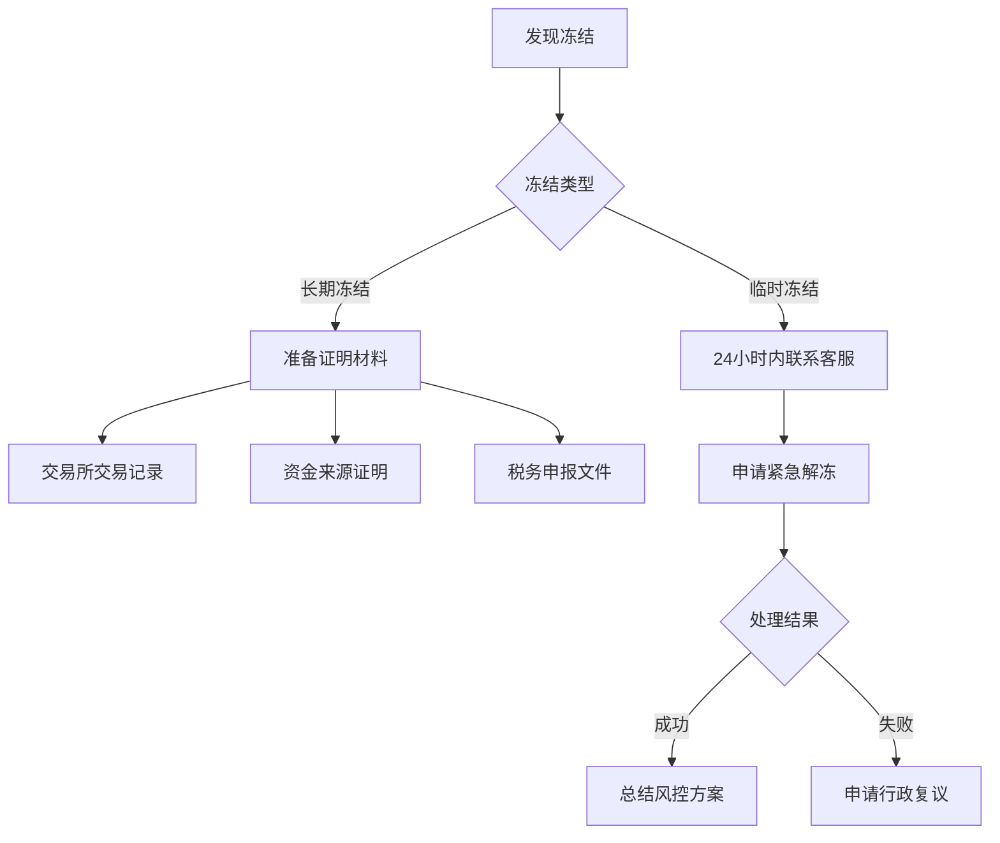

# 买比特币会导致银行卡冻结吗？深入解析风险与应对策略

在数字货币迅猛发展的当下，比特币作为最具代表性的虚拟资产吸引了大量投资者。然而，伴随机遇而来的还有潜在风险，特别是涉及银行账户安全时，许多用户存在疑虑：**买比特币会导致银行卡冻结吗**？本文将从风险成因、应对策略及实用建议三个维度进行深度解析，助您安全参与数字资产投资。

---

## 银行卡冻结的核心风险点

### 1. 银行风控机制的触发条件
现代银行系统普遍采用AI驱动的反欺诈模型，以下行为易触发警报：
- **高频交易**：单日多次大额转账至交易所账户
- **跨区域交易**：账户登录地与IP地址存在地理冲突
- **异常交易模式**：短期内交易金额远超账户历史水平

> 案例：某用户通过银行卡单笔转账50万元至某小型交易所，系统自动冻结账户并启动人工审核，导致资金冻结72小时。

### 2. 交易平台合规性风险
据Chainalysis 2024年报告显示，全球TOP10交易所的合规支出占运营成本平均达23%，而非合规平台仅占3%。选择不同平台将直接影响资金安全：
| 平台类型       | 冻结风险概率 | 平均解冻时长 | 用户权益保障 |
|----------------|--------------|--------------|--------------|
| 持牌合规平台   | 12%          | 24-48小时    | 完善         |
| 无监管新兴平台 | 37%          | 3-7天        | 不完善       |
| 场外OTC平台    | 8%           | 即时解冻     | 取决于中介   |

### 3. 地缘政策差异
各国监管态度呈现明显分化：
- 🟢 **新加坡/日本**：持牌交易所可正常接入银行系统
- 🟡 **美国**：超5万美元交易需提交IRS税务证明
- 🔴 **中国**：禁止金融机构为虚拟货币交易提供服务

---

## 三重防御体系构建

### 防御策略一：平台选择优先级
👉 [选择合规加密平台](https://bit.ly/okx_welcome)，建议遵循"三查原则"：
1. 查证照：确认持有美国MSB、欧盟EMI等国际牌照
2. 查审计：优先选择通过CertiK或慢雾科技安全审计的平台
3. 查保险：选择投保Coincover等数字资产保险的交易所

### 防御策略二：交易行为优化
- **资金分流**：将投资资金转入独立数字钱包操作，与日常消费账户隔离
- **时间分散**：将大额交易拆分为3-5笔，间隔4小时以上完成
- **链路透明**：选择支持区块链浏览器实时查询的交易所

### 防御策略三：银行政策对接
建议操作流程：
1. 提前15个工作日向客户经理报备投资计划
2. 申请开通"高风险交易白名单"服务（部分银行提供）
3. 绑定手机银行实时提醒，监测账户状态变化

---

## 常见问题解答（FAQ）

### Q1：银行卡被冻结后如何快速解冻？
A：立即执行以下步骤：
1. 拨打银行VIP专线说明交易性质
2. 提供交易所实名认证截图
3. 提交近3个月银行流水证明资金合法性

### Q2：使用信用卡购买加密货币有何特殊风险？
A：存在三重额外成本：
- 现金预支手续费（通常为3-5%）
- 高额利息（日息0.05%-0.1%）
- 可能触发"高风险消费"降额机制

### Q3：如何监测账户冻结预警信号？
A：关注以下异常现象：
- 登录时突然要求视频认证
- 转账限额无故降低
- 收到"账户安全升级"提示

---

## 冻结事件应急处理指南

当遭遇账户冻结时，建议按以下流程处理：

---

## 资产配置建议

根据投资经验不同，推荐以下风险对冲方案：

| 投资者类型   | 比特币配置比例 | 对冲工具建议         | 冻结风险系数 |
|--------------|----------------|----------------------|--------------|
| 新手投资者   | ≤5%            | 稳定币定投           | 低           |
| 进阶投资者   | 5-15%          | 期权组合+黄金ETF     | 中           |
| 专业投资者   | 15-30%         | 跨市场套利+保险对冲  | 高           |

---

## 未来趋势展望

据国际清算银行（BIS）预测，2025年全球将有超过30个国家建立加密货币"监管沙盒"。建议投资者：
1. 关注央行数字货币（CBDC）与比特币的协同效应
2. 参与合规的STO（证券型代币发行）项目
3. 配置去中心化金融（DeFi）保险产品

👉 [把握合规投资机遇](https://bit.ly/okx_welcome)，在数字资产新时代实现财富稳健增值。通过建立科学的风险管理体系，投资者完全可以在合规框架内安全参与比特币投资，将银行卡冻结风险控制在可接受范围内。记住，持续学习行业动态与监管政策，才是长期投资成功的关键保障。