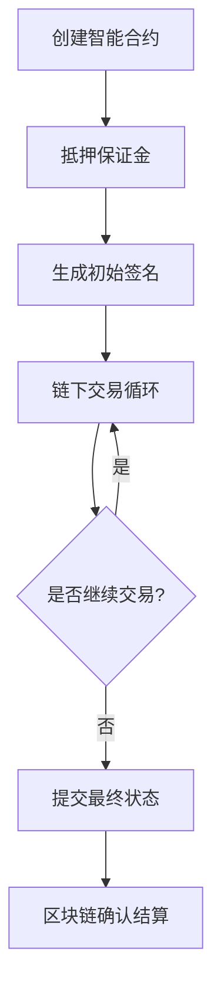

# 什么是支付通道？

## 核心概念解析

支付通道（Payment Channel）是区块链技术中突破性能瓶颈的关键创新，通过链下交易机制实现高效价值转移。这项技术既能保持区块链的去中心化特性，又能解决交易确认速度慢、手续费高的痛点，为Web3.0时代的高频交易场景提供可行方案。

👉 [区块链技术如何改变金融生态](https://bit.ly/okx_welcome)

### 技术架构解析
支付通道本质上是一种智能合约协议，其运作包含三个核心阶段：
1. **资金托管**：交易双方将资金锁定至多重签名智能合约
2. **链下交互**：通过数字签名进行无限次即时交易，仅需最终状态上链
3. **结算确认**：任一方可随时关闭通道，将最终余额记录到主区块链

这种机制使得每秒交易处理量（TPS）从比特币的7笔提升至百万级，同时手续费降低99%以上。

## 运作机制深度解析

### 双方交易流程

### 安全保障机制
支付通道采用双重保障设计：
| 机制类型 | 实现方式 | 安全效果 |
|---------|---------|---------|
| 挑战期设计 | 设置7-30天争议窗口 | 防止恶意关闭通道 |
| 惩罚机制 | 过期签名将损失保证金 | 抑制双花攻击 |

👉 [如何选择安全的区块链钱包](https://bit.ly/okx_welcome)

## 核心优势对比分析

与传统链上交易相比，支付通道在四个维度实现突破性提升：

| 指标         | 链上交易       | 支付通道       |
|--------------|----------------|----------------|
| 交易速度     | 10分钟-数小时  | 即时完成       |
| 手续费       | $0.5-$5/笔     | <$0.001/笔     |
| 隐私保护     | 公开透明       | 私密交互       |
| 系统吞吐量   | 千级TPS        | 百万级TPS      |

### 实际应用场景
1. **零售支付**：便利店每笔咖啡交易耗时仅需0.5秒
2. **物联网结算**：智能电表每分钟自动结算电费
3. **游戏经济系统**：玩家间道具交易零确认延迟

## 常见问题解答（FAQ）

Q: 支付通道是否适用于所有区块链项目？  
A: 主要适用于支持智能合约的区块链，比特币通过闪电网络实现，以太坊则有Raiden网络等方案

Q: 如何保障通道内的资金安全？  
A: 采用多重签名技术+时间锁机制，任何单方违规将触发自动惩罚

Q: 通道关闭需要多长时间？  
A: 标准流程需24小时至7天，取决于预设的挑战期设置

Q: 能否进行跨链支付？  
A: 通过原子交换技术可实现跨链通道，但目前仍处实验阶段

## 未来发展展望

随着Layer2技术的演进，支付通道正朝着三个方向发展：
1. **网络化**：从点对点通道向多跳路由网络演进（如闪电网络节点已达15万+）
2. **标准化**：EIP-1559等协议改进提升通道管理效率
3. **融合创新**：与零知识证明结合实现隐私支付通道

👉 [探索Web3.0未来生态](https://bit.ly/okx_welcome)

### 技术演进时间轴
| 年份 | 里程碑事件                  | 技术突破                |
|------|-----------------------------|-------------------------|
| 2015 | 比特币闪电网络白皮书发布    | 首次提出支付通道概念    |
| 2017 | 闪电网络首次主网测试        | 实现基础功能验证        |
| 2020 | 以太坊Rollup方案兴起        | 通道技术扩展至智能合约  |
| 2023 | 多链互操作通道实验成功      | 实现跨链价值转移        |

这项技术正在重塑区块链的价值传输方式，据剑桥大学研究显示，支付通道网络的交易量已占比特币总交易量的35%，预示着链下扩展方案正在成为区块链基础设施的重要组成部分。