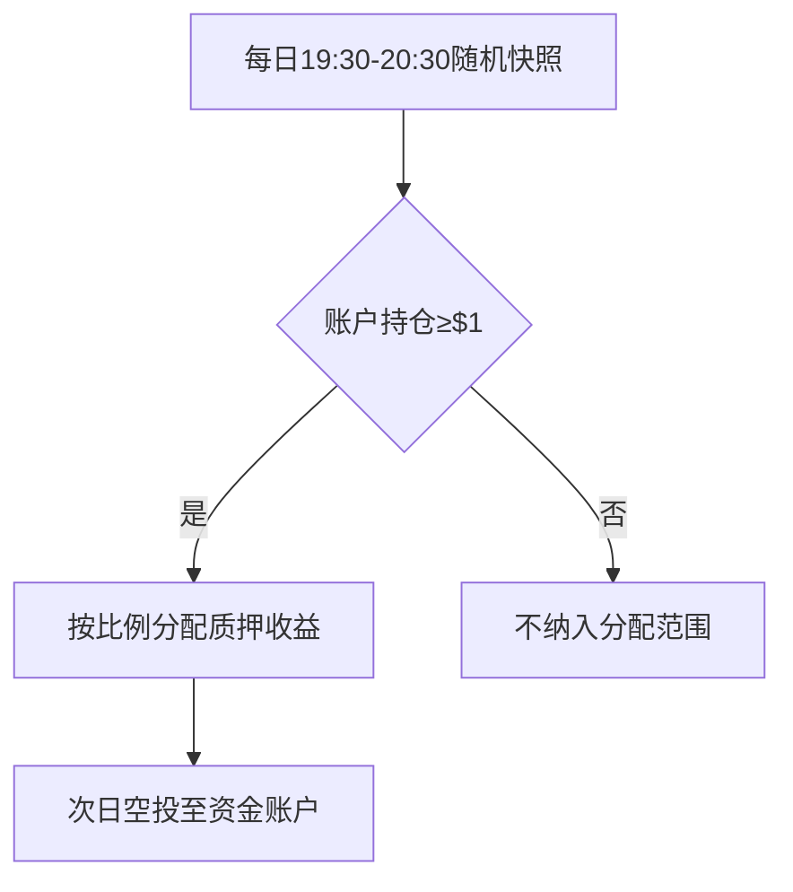

# 欧易上线Lido Staked Ether(STETH)质押服务公告

## 上线时间安排
欧易平台正式接入STETH质押服务，具体时间节点如下：

| 服务类型   | 开启时间                  |
|------------|---------------------------|
| 充值服务   | 7月18日10:00 (UTC+8)      |
| 交易服务   | 7月18日18:00 (UTC+8)      |
| 提现服务   | 7月19日18:00 (UTC+8)      |

👉 [立即了解STETH投资机会](https://bit.ly/okx_welcome)

## STETH代币解析
**Lido Staked Ether**（简称STETH）作为以太坊质押领域的创新金融工具，具备以下核心特性：

1. **流动性解决方案**  
通过rebase机制实现质押资产的流动性，用户可随时交易质押衍生品，无需等待以太坊主网解锁期

2. **收益复合增长**  
每日自动更新质押份额（UTC+8每日7:30-8:30），实时反映质押收益累积情况

3. **跨平台兼容性**  
支持在DeFi协议中作为抵押品使用，提升资产利用率

## 分红机制详解
欧易平台采用智能化权益分配系统，具体流程如下：

**注意事项**：
- 母子账号合并计算持仓
- 充提中的资产不计入统计
- 收益以STETH代币形式发放

👉 [探索更多数字资产投资](https://bit.ly/okx_welcome)

## 常见问题解答

**Q：STETH与ETH直接质押有何区别？**  
A：STETH通过代币化设计解决传统质押的流动性锁定问题，用户既可享受质押收益，又能保持资产流动性参与其他投资。

**Q：如何提升空投收益？**  
A：建议采取以下策略：
1. 保持账户持仓超过$1美金价值
2. 在快照时段前完成资产归集
3. 通过金融产品提升持仓规模

**Q：STETH适合哪些投资者？**  
A：适用于希望获取以太坊质押收益同时保持资产流动性的用户，尤其适合：
- 中长期持有ETH的投资者
- DeFi生态参与者
- 收益聚合策略使用者

## 市场价值分析
STETH作为Lido协议的核心产品，已占据以太坊质押市场超过30%的份额。相较于传统质押方式，其优势体现在：

| 对比维度       | 传统质押       | STETH质押       |
|----------------|----------------|-----------------|
| 流动性         | 无             | 可交易          |
| 最小质押门槛   | 32 ETH         | 无限制          |
| 收益提取周期   | 以太坊解锁期   | 每日rebase      |
| DeFi兼容性     | 否             | 支持            |

## 投资策略建议
新手投资者可参考以下操作指南：

1. **仓位管理**：建议初始投入不超过数字资产配置的15%
2. **复利优化**：将每日空投收益再投资以提升长期收益
3. **风险对冲**：通过ETH期权等工具对冲价格波动风险

👉 [获取专业投资指导](https://bit.ly/okx_welcome)

## 风险提示
数字资产投资存在市场波动风险，建议投资者：
- 定期关注以太坊网络升级动态
- 设置自动止盈止损机制
- 分散配置不同资产类别
